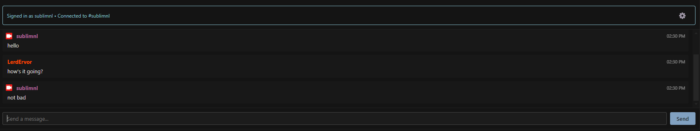
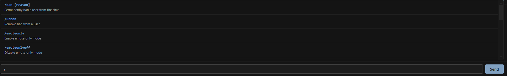
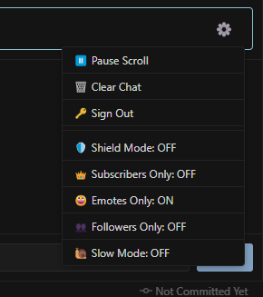

# Twitch Chat Viewer

A VSCode/Cursor extension that brings Twitch chat directly into your IDE, designed for streamers who code. Read chat, send messages, and moderate your community without leaving your editor.

## Features

### Chat Experience
- **Bottom Panel Integration**: Chat appears alongside Terminal and Debug Console
- **Send Messages**: Participate in chat by sending messages (requires authentication)
- **Expanded Emote Support**: Twitch, FrankerFaceZ (FFZ), BetterTTV (BTTV), and 7TV emotes render inline
- **First-Time Chatter Highlighting**: Special badge for users chatting in your channel for the first time
- **Subscription & Bit Notifications**: Special styling for subs, resubs, gift subs, and bit cheers
- **Pause Scroll**: Pause auto-scrolling to read chat history without interruption
- **Unread Counter**: Badge shows unread messages when the panel isn't active

### Moderation Tools (Authenticated)
- **Click-to-Moderate**: Click any username to access quick moderation actions
  - Timeout
  - Ban/Unban users
  - Delete individual messages

### Chat Commands (Authenticated)
Type `/` to see all available commands with intelligent autocomplete:

**Moderation:**
- `/ban <username>` - Permanently ban a user
- `/unban <username>` - Remove a ban
- `/timeout <username> [duration]` - Timeout a user (default: 10 min)
- `/untimeout <username>` - Remove a timeout

**Chat Modes:**
- `/emoteonly` / `/emoteonlyoff` - Toggle emote-only mode
- `/followers [duration]` / `/followersoff` - Toggle followers-only mode
- `/shield` / `/shieldoff` - Toggle Shield Mode
- `/slow [seconds]` / `/slowoff` - Toggle slow mode (default: 30s)
- `/subscribers` / `/subscribersoff` - Toggle subscribers-only mode

**Command Features:**
- Autocomplete with keyboard navigation (↑/↓, Tab, Enter, Esc)
- Inline descriptions and argument hints
- Commands execute locally (not sent as chat messages)

### Chat Mode Controls (Authenticated)

Access via the settings gear button:
- **Shield Mode** - Enhanced moderation (auto-polls every 30 seconds)
- **Subscribers-Only** - Limit chat to subscribers
- **Emotes-Only** - Only emotes allowed in chat
- **Followers-Only** - Require following (customizable duration)
- **Slow Mode** - Rate limit messages
- **Pause Scroll** - Toggle auto-scrolling
- **Clear Chat** - Clear your local chat history

## Installation

### From VSIX File

1. Download the `.vsix` file from the releases page
2. Open VSCode/Cursor
3. Open the Command Palette (Ctrl+Shift+P / Cmd+Shift+P)
4. Type "Extensions: Install from VSIX..."
5. Select the command and choose the downloaded `.vsix` file

### From Marketplace

**VS Code:**
Search for "Twitch Chat Viewer" in the VS Code extensions marketplace and click Install.

**VSCodium / Cursor / Other Editors:**
This extension is also available on [Open VSX Registry](https://open-vsx.org/). Search for "Twitch Chat Viewer" in your editor's extension marketplace.

## Usage

1. Open settings:
   - VSCode: `Ctrl+,` / `Cmd+,` 
   - Cursor: Open Command Palette (`Ctrl+Shift+P` / `Cmd+Shift+P`) and search for "Preferences: Open Settings"
2. Search for "Twitch Chat"
3. Enter the Twitch channel/username you want to watch in the `Twitch Chat: Channel` setting
4. Open the bottom panel (where Terminal is located)
5. Look for the "Twitch Chat" tab
6. Enjoy watching chat!

### Keyboard Shortcut

Quickly open or focus the Twitch Chat panel:
- Windows/Linux: `Ctrl+Alt+T`
- Mac: `Cmd+Alt+T`

You can also find the "View: Focus Twitch Chat" command in the Command Palette.

### Authentication (Optional)

By default, the extension connects anonymously and provides read-only access to chat. To send messages and unlock moderation features, you can sign in with Twitch:

#### How to Sign In:

1. **Open Settings Menu**:
   - Open the Twitch Chat panel
   - Click the **Settings Gear** button in the header
   - Click **"Sign In"**

2. **Authorize with Twitch**:
   - Your browser will open to Twitch's authorization page
   - Click "Authorize" to grant permissions
   - The browser will show a success message

3. **Return to VS Code**:
   - You're now signed in!
   - Your username appears in the header
   - The message input box is now active
   - The settings menu shows chat mode controls
   - Type your message and press Enter or click Send!

**What authentication enables:**
- Send messages to chat (your messages appear in the log)
- BTTV and 7TV emotes (global and channel-specific)
- Moderation tools (click usernames or use `/` commands)
- Chat mode controls (Shield Mode, Subs-Only, etc.)

**Security & Privacy:**
- Uses Twitch's **OAuth 2.0 Implicit Grant Flow**
- Local authentication server runs only during sign-in (port 3000)
- Your tokens are never exposed in settings or logs
- You can sign out anytime from the settings menu

**To sign out**: Click the Settings Gear → "Sign Out"

### Configuration

- `twitchChat.channel`: The Twitch channel/username to view chat from (without the # symbol)

## Features in Detail

### Unread Message Counter

When you're viewing a different panel (like Terminal), an unread badge will appear on the Twitch Chat tab showing how many new messages have arrived. The counter resets when you switch back to the chat view.

### Emote Support

- **Twitch Emotes**: All native Twitch emotes are automatically detected and displayed
- **FrankerFaceZ (FFZ)**: Global and channel-specific FFZ emotes are supported
- **BetterTTV (BTTV)**: Global and channel-specific BTTV emotes (requires authentication)
- **7TV**: Global and channel-specific 7TV emotes (requires authentication)
- Emotes are fetched when connecting to a channel and rendered inline with chat messages

### Chat History

The extension maintains a rolling history of the last 200 messages to keep memory usage reasonable. Use the "Pause Scroll" feature to read history without new messages auto-scrolling.

## Authentication Modes

This extension supports two modes:

**Anonymous Mode (Default)**:
- No authentication required
- Read-only chat access
- Works immediately after configuration
- Twitch and FFZ emotes only

**Authenticated Mode (Optional)**:
- Secure OAuth 2.0 Implicit Grant Flow
- No backend server or secrets required
- Send messages to chat
- Full moderation toolkit (ban, timeout, delete)
- Chat mode controls (Shield Mode, Subs-Only, etc.)
- BTTV and 7TV emotes

## Requirements

- VSCode or Cursor version 1.85.0 or higher
- Internet connection to connect to Twitch chat via WebSocket

## Contributing

Contributions are welcome! Please feel free to submit issues or pull requests.

## License

This extension is licensed under the MIT License. See the LICENSE file for details.

## Credits

- Built with [tmi.js](https://github.com/tmijs/tmi.js) for Twitch IRC WebSocket connectivity

## Disclaimer

This is an unofficial extension and is not affiliated with Twitch Interactive, Inc.
